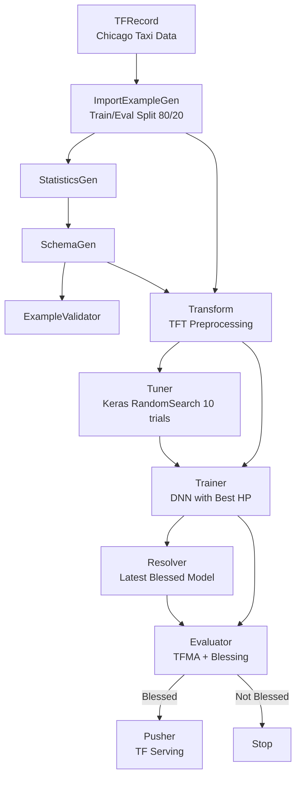

# Chicago Taxi TFX Pipeline


[](https://chicago-taxi-mlops-production.up.railway.app/v1/models/taxi-model)

An end-to-end machine learning pipeline for Chicago taxi tip prediction using TensorFlow Extended (TFX). This project predicts whether a taxi passenger will tip based on trip characteristics — covering data validation, preprocessing, hyperparameter tuning, model training, evaluation, and production deployment with TensorFlow Serving, Prometheus, and Grafana.

---

## Table of Contents
- [Overview](#overview)
- [Tech Stack](#tech-stack)
- [Project Structure](#project-structure)
- [Dataset](#dataset)
- [Getting Started](#getting-started)
- [Pipeline Diagram](#pipeline-diagram)
- [Experiment Results](#experiment-results)
- [Author](#author)

---

## Overview

This project builds a complete ML pipeline to predict whether a passenger will **tip or not** based on trip metadata (distance, fare, duration, payment method, company, etc.).

**Pipeline stages:**
1. **Data Ingestion** — TFRecord loading with `ImportExampleGen`
2. **Data Validation** — Statistics generation, schema inference, anomaly detection
3. **Transform** — Feature preprocessing via TensorFlow Transform (categorical encoding + vocabulary generation)
4. **Hyperparameter Tuning** — Keras Tuner RandomSearch (10 trials, 5 epochs each)
5. **Training** — Deep Neural Network with BatchNormalization and Dropout
6. **Evaluation** — TFMA with blessing threshold
7. **Deployment** — Push to TensorFlow Serving (C++ REST API)

---

## Tech Stack

| Category | Tools |
|---|---|
| Language | Python 3.9 |
| ML Pipeline | TensorFlow Extended (TFX) 1.11.0 |
| Deep Learning | TensorFlow 2.10, Keras |
| Hyperparameter Tuning | Keras Tuner |
| Model Evaluation | TensorFlow Model Analysis (TFMA) |
| Serving | TensorFlow Serving (Docker + Railway) |
| Monitoring | Prometheus + Grafana |
| Data Source | Chicago Taxi Trips (City of Chicago) |

---

## Project Structure

```
chicago-taxi-mlops/
├── README.md
├── requirements.txt
├── setup.sh                          # Environment setup script
├── Dockerfile                        # TF Serving deployment image
├── docker-compose.yml                # Local monitoring stack
├── run_pipeline.py                   # Entry point to run TFX pipeline
├── rebuild_serving_model.py          # Rebuild serving model with tf.Example input
├── chicago-taxi-pipeline.ipynb       # Main pipeline notebook
├── chicago-taxi-testing.ipynb        # Prediction testing notebook
├── taxi_pipeline/                    # TFX pipeline Python package
│   ├── __init__.py
│   ├── configs.py                    # Pipeline configuration
│   ├── components.py                 # Component factory functions
│   └── pipeline_def.py               # Pipeline definition
├── modules/                          # TFX user module files
│   ├── transform.py                  # TFT preprocessing
│   ├── trainer.py                    # Model definition + training
│   ├── tuner.py                      # Hyperparameter search
│   └── model.py                      # Shared model architecture
├── monitoring/                       # Observability stack
│   ├── prometheus.yml                # Prometheus scrape config
│   ├── traffic_generator.py          # Load generator script
│   ├── Dockerfile                    # Prometheus container
│   └── grafana/                      # Dashboard provisioning
├── config/
│   └── prometheus.config             # TF Serving monitoring config
├── data/
│   └── data.csv                      # Raw dataset
├── Dockerfile                        # TF Serving deployment image
├── rebuild_serving_model.py          # Regenerate serving model
├── run_pipeline.py                   # Pipeline entry point
├── setup.sh                          # Environment setup
├── requirements.txt
├── docker-compose.yml                # Local monitoring stack
├── chicago-taxi-pipeline.ipynb       # Pipeline walkthrough notebook
└── chicago-taxi-testing.ipynb        # Prediction testing notebook
```

---

## Live Deployment

The model is deployed on **Railway** using TensorFlow Serving (C++):

```
https://chicago-taxi-mlops-production.up.railway.app
```

### Model Status
```bash
curl https://chicago-taxi-mlops-production.up.railway.app/v1/models/taxi-model
```

### Prediction Request
```bash
# Credit Card → Tip (prob ~0.98)
curl -X POST https://chicago-taxi-mlops-production.up.railway.app/v1/models/taxi-model:predict \
  -H "Content-Type: application/json" \
  -d '{"instances":[{"examples":{"b64":"ChsKFQoIdHJpcF9taWxlcxIJCgIIA...”}}}]}'
```

---

## Dataset

- **Source**: [Chicago Taxi Trips](https://data.cityofchicago.org/Transportation/Taxi-Trips/wrvz-psew)
- **Size**: ~50,000 rows
- **Task**: Binary Classification (Tip or No Tip)
- **Features**: 4 numerical + 5 categorical:
  - Numerical: `trip_miles`, `fare`, `trip_seconds`, `trip_start_timestamp`
  - Categorical: `payment_type`, `company`, `trip_start_hour`, `trip_start_day`, `trip_start_month`
- **Label**: `tips` → binary (1 if tip > 0, 0 otherwise)

---

## Getting Started

### Prerequisites
- Linux / WSL2 (recommended)
- Docker (for TF Serving + monitoring)
- Miniconda (for Python environment)

### 1. Clone Repository
```bash
git clone https://github.com/sintiasnn/chicago-taxi-mlops.git
cd chicago-taxi-mlops
```

### 2. Setup Environment

```bash
conda create -n chicago-taxi-mlops python=3.9 -y
conda activate chicago-taxi-mlops
pip install -r requirements.txt
```

### 3. Run Pipeline
```bash
python run_pipeline.py
```

Or open `chicago-taxi-pipeline.ipynb` in Jupyter for a step-by-step walkthrough.

### 4. Serve Model with TensorFlow Serving
```bash
docker run -p 8501:8501 \
  --mount type=bind,source=$(pwd)/serving_model,target=/models/taxi-model \
  -e MODEL_NAME=taxi-model \
  -t tensorflow/serving
```

### 5. Test Predictions
Open and run `chicago-taxi-testing.ipynb` to send tf.Example prediction requests.

### 6. Build & Push to Registry

```bash
# Build image
docker build -t ghcr.io/sintiasnn/chicago-taxi-mlops:v1 .

# Push to GitHub Container Registry
docker push ghcr.io/sintiasnn/chicago-taxi-mlops:v1
```

### 7. Deploy to Railway

1. Buka [Railway Dashboard](https://railway.app/dashboard) → **New Project** → **Deploy from Image**
2. Masukkan image: `ghcr.io/sintiasnn/chicago-taxi-mlops:v1`
3. Di **Settings** → set **Port** = `8501`
4. Railway otomatis memberikan domain: `chicago-taxi-mlops-production.up.railway.app`

**Verifikasi deployment:**
```bash
curl https://chicago-taxi-mlops-production.up.railway.app/v1/models/taxi-model
```

### 8. Monitoring
```bash
# Start Prometheus + Grafana
docker compose -f monitoring/docker-compose.yml up -d

# Run traffic generator
python monitoring/traffic_generator.py
```

---

## Pipeline Diagram



---

## Experiment Results

| Metric | Value |
|---|---|
| Binary Accuracy | **~0.86** |
| AUC-ROC | **~0.92** |

**Best Hyperparameters (Tuner):**
- `units_1`: 384
- `units_2`: 64
- `units_3`: 128
- `dropout_rate`: 0.2
- `learning_rate`: 0.001

**Prediction Samples:**
| Payment | Tip Probability | Prediction |
|---|---|---|
| Credit Card | 0.9845 | Tip |
| Cash | 0.0175 | No Tip |

---

## Author

**Ni Putu Sintia Wati**
- GitHub: [@sintiasnn](https://github.com/sintiasnn)

---

## License

This project is open source and available under the [MIT License](LICENSE).
